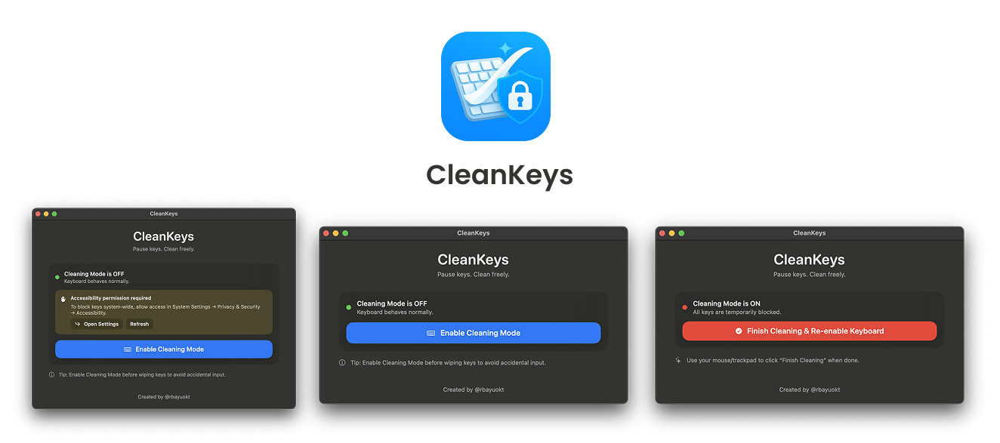

# CleanKeys

<br/><br/>

Minimal macOS utility that **pauses your keyboard system-wide** so you can clean it without accidental keystrokes

## Overview

- **What it does:** Installs a global event tap to swallow all key events while “Cleaning Mode” is ON. Click the button again to restore normal typing.
- **Why:** Prevents accidental input (and surprise emails 😅) when you wipe keys. lol


## Stack

- **Language:** Swift
- **Frameworks:** SwiftUI, AppKit
- **APIs:** `CGEventTap` / `CGEvent.tapCreate` (global keyboard block), Accessibility/TCC (`AXIsProcessTrustedWithOptions`)
- **Architecture:** MVVM + feature-first folders + small reusable components
- **Minimum macOS:** 12+ recommended
- **Build system:** Xcode / `xcodebuild`


## Features

- **One-click cleaning mode** - blocks `keyDown`, `keyUp`, and `flagsChanged`.
- **Permission-aware** - prompts once, deep-links to System Settings, and shows a clear banner until enabled.
- **Polished UI** - fixed, balanced layout; auto-resizes window when permission is granted; consistent spacing & typography.
- **Safe exit** - cleaning mode auto-disables on view disappear/quit.
- **Design system** - tokens (spacing), primary button style, small composable views.
- **MVVM** - clear separation of UI, state, and services, dependency-injected `KeyboardBlocking` service.

```
CleanKeys/
├─ App/
│  └─ KeyCleanApp.swift
├─ Core/
│  ├─ Models/
│  │  └─ CleaningState.swift
│  ├─ Protocols/
│  │  └─ KeyboardBlocking.swift
│  ├─ Services/
│  │  └─ KeyboardBlocker.swift
│  └─ Utils/
│     ├─ AccessibilityHelper.swift
│     └─ WindowSizing.swift
├─ DesignSystem/
│  ├─ Styles/
│  │  └─ PrimaryButtonStyle.swift
│  └─ Tokens/
│     └─ Spacing.swift
└─ Features/
   └─ Cleaning/
      ├─ ViewModels/
      │  └─ CleaningViewModel.swift
      ├─ Views/
      │  └─ ContentView.swift
      └─ Components/
         ├─ AppBackground.swift
         ├─ HeaderView.swift
         ├─ StatusRow.swift
         ├─ PermissionBanner.swift
         ├─ TipsRow.swift
         └─ FooterCredit.swift
```


## How to run it

### Option A - Xcode (development)

1. Open the project in **Xcode**.
2. Target **CleanKeys** → **Signing & Capabilities**  
   - Set a unique **Bundle Identifier** (e.g., `co.riz.cleankeys`).  
   - Select your **Team** (Personal Team is fine).
3. Select scheme **CleanKeys** → destination **My Mac**.
4. Press **⌘R** to run.
5. Click **Enable Cleaning Mode**. If permission isn’t granted yet, the app will prompt and open System Settings (see below).

> SwiftUI **Previews** are great for UI, but they **do not** execute the event tap. Use **⌘R** to test blocking.

### Option B - Release build (unsigned, for sharing)

Build a Release app locally and zip it:

```bash
# From the project root:
xcodebuild -scheme CleanKeys -configuration Release CODE_SIGNING_ALLOWED=NO -derivedDataPath ./build clean build

# Open the built app:
open ./build/Build/Products/Release

# Zip it ( optional ):
cd ./build/Build/Products/Release
ditto -c -k --sequesterRsrc --keepParent "CleanKeys.app" "CleanKeys.zip"
```

Distribute `CleanKeys.zip`.

For users opening an **unsigned** app:

- Right-click **CleanKeys.app** → **Open** → **Open** (only once),  
  or **System Settings → Privacy & Security** → **Open Anyway**.


### Option C - Install from the zip (no Xcode)

1. Download **CleanKeys.zip**
2. Unzip it (double-click in Finder).
3. Drag **CleanKeys.app** into /Applications (recommended) or ~/Applications.
4. First launch: Right-click CleanKeys.app → Open → Open (bypasses Gatekeeper for unsigned apps).
5. In the app, click Enable Cleaning Mode. If prompted, proceed with the Accessibility steps below.

## Then follow the **permission** steps below :


## How to add / enable Accessibility permission

macOS requires **user approval** to allow apps to observe/control input. CleanKeys requests this the first time you need it.

### Expected flow

1. Launch CleanKeys and click **Enable Cleaning Mode**.  
   The app calls `AXIsProcessTrustedWithOptions(...Prompt: true)` (Apple may show the prompt once per install).
2. Go to **System Settings → Privacy & Security → Accessibility**.
3. Find **CleanKeys** in the list and toggle it **ON**.
4. Return to the app and click **Enable Cleaning Mode** again (or use the **Refresh** button in the banner if present).  
   The status should read **Cleaning Mode is ON**.

### If you don’t see CleanKeys in the list

- Ensure you’re running the **actual app bundle**, not just Preview.  
  In Xcode: **Product → Show Build Folder in Finder** → open the `.app` from `Build/Products/Debug` (or `Release`) and run it.
- Add it manually: In **Accessibility**, click **＋**, pick your **CleanKeys.app**, then toggle it **ON**.
- If it’s still not listed, reset the TCC entry (safe):

```bash
tccutil reset Accessibility co.riz.cleankeys
```

Re-run CleanKeys, click **Enable Cleaning Mode**, and enable it again.

> Tip: CleanKeys deep-links to the pane:  
> `x-apple.systempreferences:com.apple.preference.security?Privacy_Accessibility`

### Troubleshooting

- **Still not blocking after enabling:** Quit and relaunch the app once.


## Notes / Security

- CleanKeys never sends data anywhere, it simply blocks/ignores key events while enabled.
- Accessibility permission is stored by macOS (TCC). Apps **cannot** auto-approve themselves.
- In managed environments, IT can pre-approve via **MDM PPPC** using the app’s bundle ID and signing requirement.


## License & Attribution

- **@rbayuokt**.  
- In-app attribution is shown in the footer: **“Created by @rbayuokt”**.
